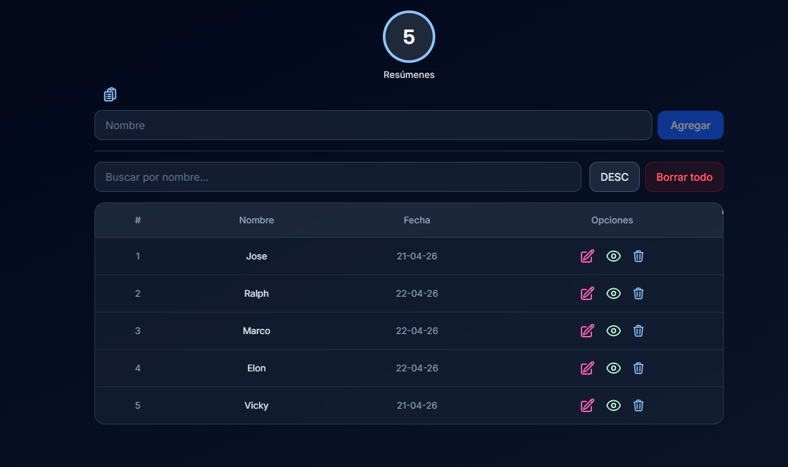
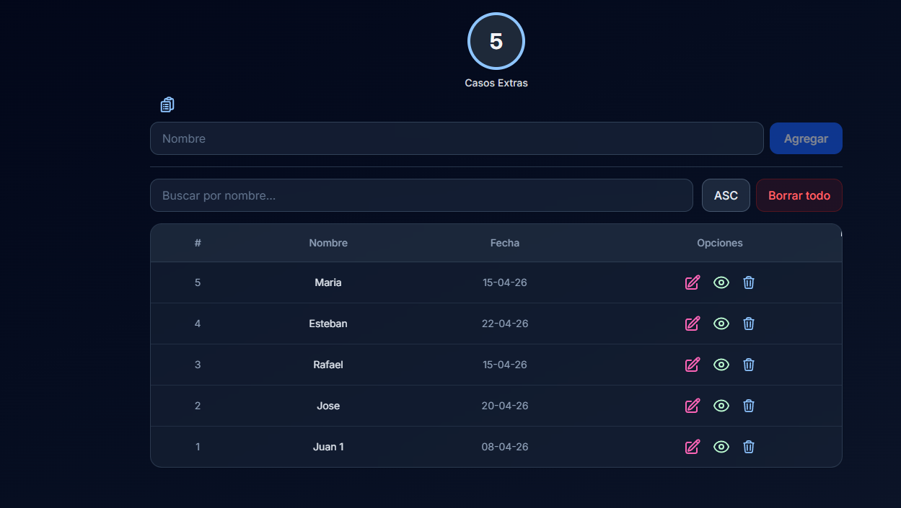
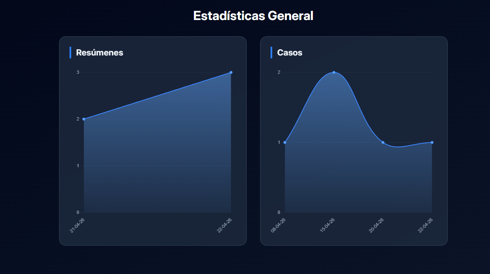

# Sumsy - Desktop App with Vue 3, Tauri 2, Vite, TailwindCSS


---
Sumsy es una aplicación moderna y ligera para gestionar tus datos de casos y resumenes de manera eficiente. Construida con las últimas tecnologías, Sumsy combina rendimiento, estilo y escalabilidad en un solo lugar.


---

## 🛠 Tecnologías Utilizadas

- **Tauri** ⚡ – Aplicación de escritorio rápida y segura.
- **Vue 3** 🖖 – Framework progresivo para interfaces reactivas.
- **TailwindCSS** 🎨 – Estilos modernos y altamente personalizables.
- **TypeScript** 📝 – Tipado estático para mayor seguridad y productividad.
- **Tauri** 📝 – Rust to create the exe with tauri.

---

## 🚀 Instalación

Clona el repositorio y corre la aplicación localmente:

```bash
git clone https://github.com/userlg/sumsy

cd sumsy
yarn
# to execute in local

yarn tauri dev

# to generate the build

yarn tauri build

# Project tree file

src/
├─ components/  # Componentes Vue reutilizables
├─ pages/       # Páginas de la app
├─ stores/      # Pinia stores
├─ modules/     # Lógica de negocio
├─ assets/      # Imágenes, fuentes y estilos
```

## Screenshots

## 

## 

## 

## 
