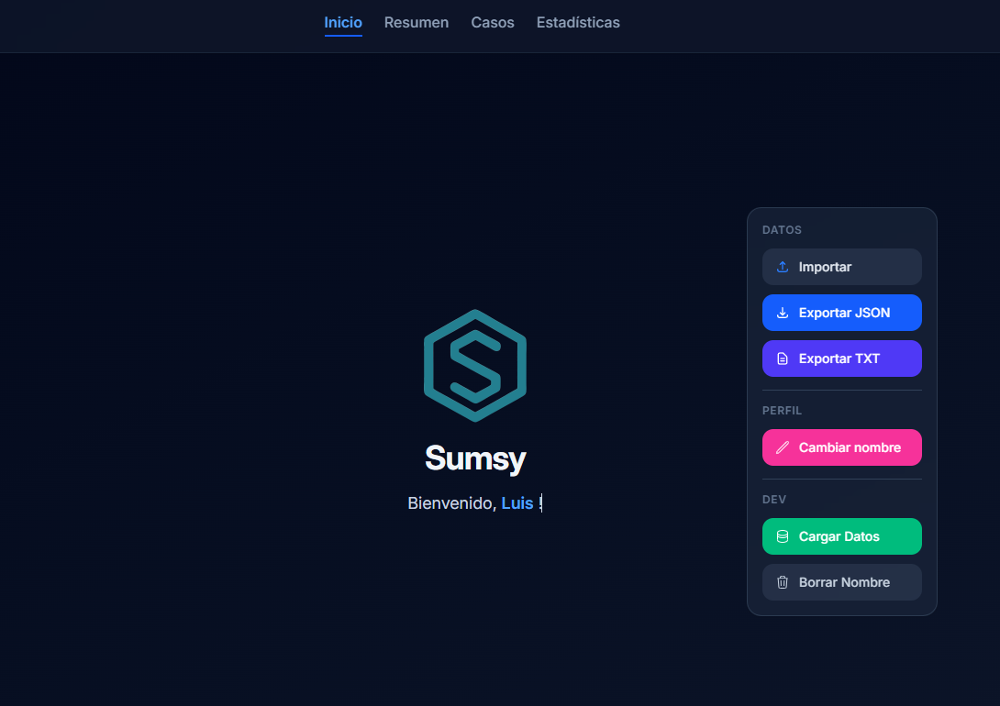

# Sumsy


**Sumsy** is a modern, high-performance desktop application designed to manage case data and summaries efficiently. Built with the latest web technologies, it offers a seamless native experience powered by Tauri and the reactive speed of Vue 3.



## ✨ Features

- **Blazing Fast**: Powered by Tauri's Rust backend for minimal resource usage.
- **Modern UI**: Polished interface with Glassmorphism, dark mode support, and smooth transitions.
- **Data Management**: Efficiently handle cases and summaries.
- **Visualize Data**: Interactive charts powered by Chart.js.
- **Desktop Native**: Works offline with native operating system integration.

## 🛠 Tech Stack

- **Core**: [Tauri 2](https://tauri.app/) (Rust + WebView)
- **Frontend**: [Vue 3](https://vuejs.org/) (Composition API)
- **Styling**: [TailwindCSS 4](https://tailwindcss.com/) + Glassmorphism
- **State Management**: [Pinia](https://pinia.vuejs.org/) (with persistence)
- **Tooling**: [Vite](https://vitejs.dev/) + [TypeScript](https://www.typescriptlang.org/)
- **Testing**: [Vitest](https://vitest.dev/)

## 🚀 Getting Started

### Prerequisites

- [Node.js](https://nodejs.org/) (v18+)
- [Rust](https://www.rust-lang.org/tools/install) (for Tauri development)
- [Yarn](https://yarnpkg.com/) or npm

### Installation

1.  **Clone the repository**

    ```bash
    git clone https://github.com/userlg/sumsy
    cd sumsy
    ```

2.  **Install Dependencies**

    ```bash
    yarn install
    # or
    npm install
    ```

3.  **Run Development Mode**
    Start the Vite dev server and Tauri window:

    ```bash
    yarn tauri dev
    # or
    npm run tauri dev
    ```

4.  **Build for Production**
    Generate the native installer/executable:
    ```bash
    yarn tauri build
    # or
    npm run tauri build
    ```

## 📂 Project Structure

```bash
src/
├── assets/      # Static assets (images, fonts)
├── components/  # Local components
├── logic/       # Business logic helpers
├── modules/     # Feature-based architecture
├── pages/       # Vue Router views
├── scripts/     # Utility scripts
├── shared/      # Shared components, styles, and utilities
│   ├── components/ # Reusable UI components (NavBar, Footer, etc.)
│   └── styles/     # Global styles (main.css, Tailwind)
├── stores/      # Pinia state stores
├── App.vue      # Root component
└── main.ts      # Application entry point
```

## 🧪 Testing

Run the test suite with Vitest:

```bash
npm run test        # Run unit tests
npm run coverage    # Generate coverage report
```

## 🤝 Contributing

Contributions are welcome! Please check [CONTRIBUTING.md](CONTRIBUTING.md) for guidelines.

## 📜 License

This project is licensed under the [MIT License](LICENSE.md).

---

© 2026 Sumsy
